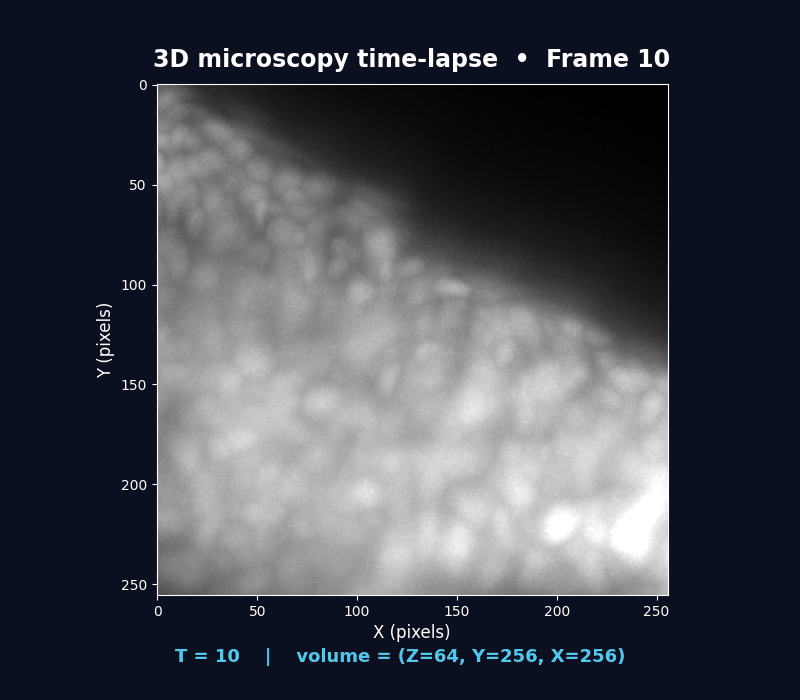

# Before the Model Sees a Cell: What Actually Happens to a Microscopy Image?

When I first looked at the cell-tracking pipeline, I expected the interesting part to begin when the neural network received the microscopy image.

It doesn't.

A surprisingly large part of the work happens **before the model gets to make a prediction**.

The input is not simply:

> "Here is an image. Find the cells."



It is a large 3D microscopy dataset with its own coordinate system, intensity range, physical scale, and resolution. Before the Temporal U-Net can make sense of it, the pipeline has to turn that raw data into something the model was actually trained to understand.

That made me realize something important about machine-learning pipelines for microscopy:

**The model is only seeing the version of the experiment that preprocessing gives it.**

---

## Starting with a 4D microscope

The source data is stored as a Zarr image.

The easiest way to picture it is as a stack of 3D volumes recorded over time:

```text
                 Time
                  │
        ┌─────────┼─────────┐
        ▼         ▼         ▼
      Frame 0   Frame 1   Frame 2   ...
        │         │         │
        ▼         ▼         ▼
       3D        3D        3D
     volume    volume    volume
```

Technically, the data has the shape:

```text
(T, Z, Y, X)
```

where:

* `T` is time,
* `Z` is depth,
* `Y` is image height,
* `X` is image width.

So a single "frame" isn't really a flat photograph.

It is a **3D volume**.


This distinction matters because a cell may be spread across several Z slices, and its position has to be understood in three spatial dimensions rather than just X and Y.

The repository's dataset loader is responsible for opening the image and reading the accompanying metadata. The `.zarr` image can also have an associated `.geff` file containing tracking information.

The relevant dataset-handling code lives in `io.py`.

---

## The first problem: brightness isn't universal

One of the first things that caught my attention was the normalization step.

Microscopy images don't necessarily have a universal intensity scale.

Imagine imaging the same kind of cells on two different days.

One experiment might produce something roughly like:

```text
dark background → 10
cell intensity   → 80
brightest signal → 120
```

Another might produce:

```text
dark background → 200
cell intensity   → 700
brightest signal → 1500
```

The biological structures could be very similar, while the numerical values are completely different.

A neural network does not automatically know that.

If it was trained on one intensity distribution and receives a very different one during inference, its predictions can become less reliable.

So the pipeline performs **quantile-based normalization**.

The basic idea is:

```text
raw intensity
      │
      ▼
identify typical low/high intensity limits
      │
      ▼
scale between them
      │
      ▼
normalized image
```

The implementation uses dataset statistics stored in:

```text
image_statistics.quantiles
```

and specifically uses the:

```text
0.001
0.999
```

quantiles.

In less mathematical language, the pipeline is roughly saying:

> "Ignore the extreme ends of the intensity distribution and use a representative low and high point to put the image onto a consistent scale."

The transformation is approximately:

```text
normalized =
    (image - q_low)
    -----------------
    (q_high - q_low + ε)
```

followed by clipping.

This is not just cosmetic image enhancement.

It is part of the **model's expected input format**.

If the model learned from images normalized this way, changing the normalization convention at inference time effectively changes the kind of images the model sees.

---

## Then there is a more subtle problem: the voxels aren't equal

This was one of the more interesting things I discovered while looking through the pipeline.

The microscopy data is **anisotropic**.

The configured voxel scale is approximately:

```text
Z = 1.625 µm
Y = 0.40625 µm
X = 0.40625 µm
```

That means one step in Z represents a much larger physical distance than one step in X or Y.

Visually:

```text
              Z
              ↑
              │
              │  1 voxel
              │
              ▼

        much larger physical distance

X/Y:  ──┼──┼──┼──┼──
          smaller steps
```

This sounds like a small implementation detail.

It isn't.

Suppose we wanted to decide whether two detected points are close enough to be considered neighbors.

If we simply counted voxels, we might assume:

```text
1 Z voxel = 1 X voxel
```

But physically:

```text
1 Z voxel = 1.625 µm
1 X voxel = 0.40625 µm
```

Those are very different distances.

So whenever the pipeline needs to reason about physical distances, it has to remember the actual voxel scale.

This becomes especially important later when the system performs cell detection and calculates distances between nodes.

---

## Why not just make everything isotropic?

There is actually a utility in the repository for doing exactly that.

The pipeline can resample an anisotropic volume so that:

```text
Z ≈ Y ≈ X
```

in physical scale.

At first, this seemed like it should simply be the obvious solution.

If the voxels are unequal, why not make them equal?

But the interesting part is that **the normal Temporal U-Net prediction path doesn't need to resample the entire image into isotropic space**.

Instead, it keeps the native data and explicitly accounts for the physical scale when necessary.

There are utilities for:

```text
resample_image_to_isotropic(...)
rescale_coords_to_isotropic(...)
rescale_coords_from_isotropic(...)
```

but isotropic resampling is therefore better understood as an available tool rather than something that must happen during every prediction.

This was a useful lesson for me:

> A pipeline doesn't necessarily need to eliminate an inconvenient property of the data. Sometimes it is better to keep the data as it is and make the algorithms aware of that property.
---

## Reducing the image before the expensive part

The next preprocessing decision is easier to appreciate from a computational perspective.

The prediction configuration uses:

```python
downsample = (1, 4, 4)
```

That means:

```text
Z → unchanged
Y → every 4th voxel
X → every 4th voxel
```

So the image becomes smaller in the XY plane while retaining its original Z sampling.

Conceptually:

```text
Original XY

████████████████████
████████████████████
████████████████████
████████████████████

          ↓

Downsampled XY

█    █    █    █
█    █    █    █
█    █    █    █
```

Why do this?

Because a 3D neural network is expensive.

Reducing the number of pixels processed in X and Y can significantly reduce the computational burden while still retaining enough spatial information for the detector.


This isn't the same as simply making the microscope image "lower quality."

It is a deliberate choice about the resolution at which the model should operate.

There is also an important consequence:

**The coordinates detected by the model initially belong to this downsampled coordinate system.**

Later, the pipeline maps those coordinates back to the original image resolution.

That coordinate journey becomes important when we reach the graph stage.

---

## The image is now ready for the model

At this point, something subtle has happened.

The original experiment started as:

```text
raw microscopy data
```

and has gradually become:

```text
dataset
   ↓
metadata-aware image
   ↓
normalized intensities
   ↓
model-compatible resolution
   ↓
temporal windows
   ↓
input to the neural network
```

None of these steps has identified a single cell yet.

There are no nodes.

There are no tracks.

There are no edges.

The pipeline is simply making sure that the neural network receives an image in the representation it expects.

And that distinction is important because the next stage changes the nature of the data completely.

The preprocessing stage works with **pixels and voxels**.

The Temporal U-Net turns those voxels into **dense learned representations and detection signals**.

From there, the pipeline eventually extracts discrete cell locations.

That transition—from an image containing potentially thousands of voxels to a manageable collection of candidate cells—is where the next part of the investigation begins.

---

## A small detail that turned out to matter

One thing I would not overlook when reproducing this pipeline is the configuration itself.

The trained model expects a particular combination of:

```text
normalization
+
voxel scale
+
downsampling
+
temporal window
```

These aren't independent knobs that can casually be changed.

For example, changing the normalization changes the intensity distribution.

Changing the downsampling changes the coordinate system and spatial resolution.

Ignoring anisotropy changes the physical interpretation of distances.

And all of these ultimately affect what the model sees.

This is why I came to think of preprocessing less as:

> "some cleanup before the model"

and more as:

> **the process of translating a physical microscopy experiment into the numerical language the model understands.**

That translation is easy to underestimate.

But without it, even a well-trained model can be looking at the wrong version of the experiment.

---

### What I took away

The most useful mental model I have for this stage is:

```text
Microscope
    │
    ▼
4D image (T, Z, Y, X)
    │
    ├── read physical metadata
    │
    ├── normalize intensities
    │
    ├── account for anisotropic voxels
    │
    └── reduce XY resolution
            │
            ▼
      model-ready image
```

The important point is that **no tracking has happened yet**.

We're still preparing the evidence.

The next question is much more interesting:

**Once the model receives this prepared volume, how does it turn a moving 3D image sequence into something that can eventually become individual cells?**
