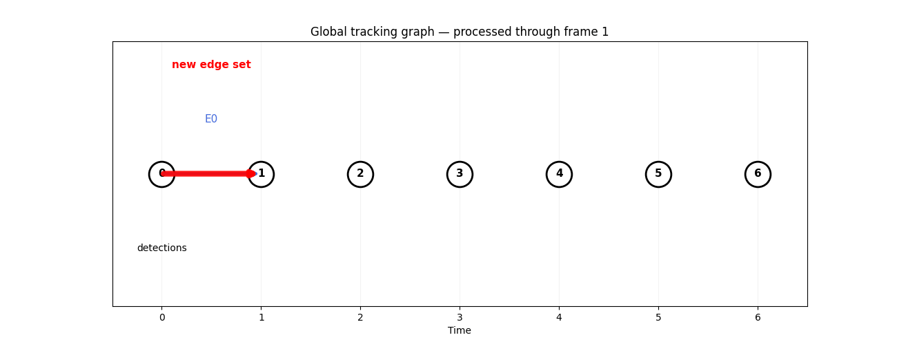

# Teaching a Machine to See Cells in a 3D Movie

When I think about cell tracking, the first question that comes to mind is:

**How does the computer know that something in a microscopy image is actually a cell?**

It sounds straightforward when looking at a processed image. We can point at a bright object and say, "That's a cell."

A computer doesn't get that privilege.

It receives numbers.

And in a 3D microscopy sequence, those numbers are spread across space and time. A bright region could be a cell, part of a cell, background fluorescence, noise, or something else entirely.

The first neural network in this pipeline is responsible for making sense of that problem.

It is called the **Temporal U-Net 3D**.

What I found interesting is that it doesn't directly produce tracks, cell identities, or even a list of cells.

Instead, it creates something much more fundamental:

**a dense representation of what is happening throughout the image.**

---

## A movie, not a collection of photographs

The model doesn't treat every frame as an isolated image.

Its input is a short sequence of 3D volumes:

```text
Frame 0        Frame 1
  │              │
  ▼              ▼
  3D volume      3D volume
       \          /
        \        /
         Temporal
          U-Net
```

For the supplied model, the temporal window is:

```text
window_size = 2
```

So the model works with pairs such as:

```text
(frame 0, frame 1)
(frame 1, frame 2)
(frame 2, frame 3)
...
```



This is already a useful clue about the architecture.

The model isn't only being asked:

> "What does this volume look like?"

It has access to a short amount of temporal context.

That gives it an opportunity to learn representations that are useful for microscopy data where structures change over time.

The prediction process uses a sliding temporal window so that consecutive frames are covered throughout the video.

The model therefore sees the experiment as a sequence rather than as a pile of unrelated images.

---

## What does a U-Net actually produce?

The name "U-Net" can make the architecture sound more complicated than it needs to be.

At a high level, I think of it as a system that looks at an image at different levels of detail.

It first builds increasingly rich representations of the input and then reconstructs spatially useful information.

A simplified picture is:

```text
Input volume
     │
     ▼
  Encoder
     │
     ▼
Compressed representation
     │
     ▼
  Decoder
     │
     ▼
Spatial representation
```


The important part here is that the network preserves spatial information.

That matters enormously for cell detection.

Knowing that a cell exists somewhere in a volume isn't enough.

The pipeline needs to know **where** it exists.

The supplied model has:

```text
U-Net layers:
[32, 64, 128]

U-Net output channels:
32
```

So the final learned representation contains 32 feature channels.

But those 32 channels aren't 32 different measurements like:

```text
cell size
cell brightness
cell radius
...
```

They're learned features.

The network has discovered numerical patterns that are useful for interpreting the image.

---

## Two things come out of the U-Net

This was probably the most important architectural distinction I found.

The U-Net produces two useful outputs:

```python
unet_out, det_logits = model.encode(imgs)
```

These serve different purposes.

The first is a **feature volume**.

The second is a **detection field**.

Conceptually:

```text
                 Temporal U-Net
                       │
              ┌────────┴────────┐
              │                 │
              ▼                 ▼
       Feature volume      Detection logits
              │                 │
              │                 ▼
              │             find cells
              │
              ▼
       describe cells
```

The detection output helps answer:

> "Where might there be a cell?"

The feature output helps answer:

> "What does the image look like around this location?"

That separation is extremely useful later.

The model first produces a rich description of the entire image.

Only afterwards does the pipeline turn that description into individual cell nodes.

---

## The detection output is still not a list of cells

This was another detail that changed how I thought about the pipeline.

It would be tempting to imagine that the neural network produces something like:

```text
Cell 1
Cell 2
Cell 3
...
```

It doesn't.

The detection output is still a dense 3D volume.

For a single frame, you can think of it as:

```text
(Z, Y, X)
```

Every spatial location receives a score.

Something like:

```text
voxel        detection score

(4,31,82)       high
(5,74,51)       low
(7,19,93)       high
...
```


So the model is effectively painting a probability-like landscape over the volume.

Bright peaks suggest:

> "A cell center might be here."

Flat or low regions suggest:

> "There probably isn't a cell center here."

The pipeline still needs another step to turn this continuous field into discrete detections.

---

## From logits to something we can interpret

The model produces **logits**, rather than probabilities.

The pipeline converts them using a sigmoid:

```python
torch.sigmoid(logits)
```

Conceptually:

```text
raw neural-network score
          │
          ▼
       sigmoid
          │
          ▼
value between 0 and 1
```

This makes the output easier to interpret as a detection confidence.

But there is an important complication.

A cell shouldn't be detected at every voxel that has a high value.

Imagine a single cell producing a bright blob:

```text
        █████
      █████████
     ███████████
      █████████
        █████
```

If every bright voxel became a detection, one cell could suddenly become dozens of cells.

The pipeline needs to identify the **peak**.

---

## Finding the peak of a cell

This is where local-maximum detection comes in.

The implementation uses 3D max pooling to identify locations that are local maxima.

In simplified form:

```python
pooled = F.max_pool3d(...)
is_peak = (logits == pooled) & (torch.sigmoid(logits) > threshold)
```

The idea is simple.

For every location, ask:

> "Is this location the strongest point in its local neighborhood?"

If yes, and its confidence is high enough, it can become a candidate cell.

So the dense field:

```text
many thousands of voxel scores
```

becomes something much smaller:

```text
candidate cell centers
```

For example:

```text
t    z    y    x

0    4   31   82
0    5   74   51
0    7   19   93
...
```

These coordinates are the first discrete representation of individual cells in the pipeline.

This is a major transition:

```text
IMAGE
  ↓
DENSE DETECTION FIELD
  ↓
LOCAL PEAKS
  ↓
CELL CANDIDATES
```

The pipeline has gone from continuous image data to discrete objects.

---

## Why the detection threshold is surprisingly important

The model uses a high default detection threshold:

```text
0.99
```

At first, that number can look strange.

Why demand such a high confidence?

Because the detection threshold isn't simply a universal statement that:

> "99% means the model is 99% sure this is a cell."

The detector was trained from sparse annotations, so the output shouldn't necessarily be interpreted as a perfectly calibrated probability.

Instead, the threshold acts more like a control over the balance between missed cells and false detections.

A lower threshold gives:

```text
more detections
     ↓
higher recall
     ↓
more potential false positives
```

A higher threshold gives:

```text
fewer detections
     ↓
higher precision
     ↓
more potential missed cells
```

For cell tracking, this tradeoff matters enormously.

Because if a cell is missed here:

```text
image
  ↓
detection
  ✗
```

the later tracking system cannot magically recover it.

There is nothing for the transformer to connect.

This is why detection quality and tracking quality are related, but not identical problems.

Cells afer detection:


---

## The detector isn't the tracker

This distinction became the central idea for me.

Suppose the model detects:

```text
Frame 0:

A
B
C
```

and:

```text
Frame 1:

D
E
F
```

At this point, the pipeline knows that these objects exist.

But it doesn't yet know:

```text
A → D
B → E
C → F
```

Those relationships belong to the next stage.

The U-Net's job is essentially:

> **Find useful visual evidence and candidate cell locations.**

The transformer later asks:

> **Which detected cells are related through time?**

Keeping these responsibilities separate makes the architecture much easier to understand.

---

## Test-time augmentation: asking the model again

There is another interesting part of the detector: test-time augmentation, or TTA.

The idea is surprisingly intuitive.

Instead of showing the model the image only once, the inference code can show it several versions of the same image.

For the XY plane, it considers:

```text
original
flip X
flip Y
flip X + Y
```


Each version is passed through the model.

Then the resulting detection logits are flipped back into the original coordinate system and averaged.

The process is roughly:

```text
                 original image
                       │
       ┌───────────────┼───────────────┐
       │               │               │
       ▼               ▼               ▼
    original         flip X          flip Y
       │               │               │
       └───────────────┼───────────────┘
                       │
                 model predictions
                       │
                       ▼
             transform predictions
               back to original
                       │
                       ▼
                average logits
                       │
                       ▼
              final detection field
```

There is also an X+Y flip.

The important detail is that the pipeline does **not** average already-thresholded detections.

It averages the model's logits first.

Only after that does the normal detection process happen.

That makes the TTA operation part of the model's inference rather than a separate post-processing trick.

---

## Why flip the image at all?

A cell shouldn't suddenly stop being a cell because the image has been mirrored horizontally.

Ideally, the detector should recognize the same biological structure regardless of whether it appears in one orientation or its mirror image.

TTA takes advantage of this.

If the model gives a similar answer under several equivalent views, that can make the final prediction more stable.

For example:

```text
original view
      ↓
cell score = strong

flipped view
      ↓
cell score = strong

other flipped view
      ↓
cell score = strong
```

Those predictions reinforce each other.

The pipeline only applies these flips in X and Y, not Z.

That choice makes sense in the context of the anisotropic microscopy data: Z has a very different physical sampling scale from X and Y.

So the augmentation strategy isn't arbitrary.

It reflects assumptions about the image and its geometry.

---

## One more physical detail: finding cells in real space

The detector also has to decide how large its local neighborhood should be when looking for peaks.

This is where the physical voxel scale becomes important again.

Suppose the pipeline wants to suppress detections that are too close together within a physical distance.

It cannot simply say:

```text
look within 5 voxels
```

because a voxel doesn't represent the same physical distance in every direction.

Instead, the physical distance is translated into an appropriate number of voxels for each axis.

So the detector understands something closer to:

```text
"Look within this physical distance"
```

rather than:

```text
"Look within the same number of voxels everywhere."
```

This is a small implementation decision with a biological consequence.

A cell is a physical object.

The microscope's coordinate grid is only how we happened to measure it.

---

## What does the U-Net actually know about a detected cell?

After detection, the pipeline can return to the feature volume produced by the U-Net.

At each detected coordinate, it samples the corresponding learned feature.

The result is a compact representation of the local image context around that cell.

For the supplied model, this feature is:

```text
32 dimensions
```

So a detected cell eventually has something like:

```text
Cell A
 ├── location
 │
 └── 32-D learned image feature
```


The location will later be converted into another 32-dimensional representation.

Those two pieces are eventually combined into the node representation used by the tracking model.

But that is where the role of the second model begins.

---

## From pixels to objects

Looking back at the entire U-Net stage, I think the most useful way to describe it is as a conversion between levels of abstraction.

At the beginning:

```text
microscopy volume
```

The information is everywhere.

Every voxel contains some intensity.

After the U-Net:

```text
dense learned features
+
dense detection field
```

The model has transformed the raw image into representations that are useful for finding cells.

After local-maximum detection:

```text
cell A → (t,z,y,x)
cell B → (t,z,y,x)
cell C → (t,z,y,x)
```

Now the pipeline has discrete objects.

That is a huge conceptual step.

We have gone from:

> "Here is a complicated 3D image."

to:

> "Here are the locations where I think individual cells are."

Only after that can the tracking problem become manageable.

---

## The most important distinction

If I had to reduce this entire stage to one diagram, it would be:

```text
              MICROSCOPY VIDEO
                     │
                     ▼
             Temporal U-Net
                     │
          ┌──────────┴──────────┐
          │                     │
          ▼                     ▼
    Feature volume        Detection logits
          │                     │
          │                     ▼
          │               sigmoid + peaks
          │                     │
          │                     ▼
          │              cell coordinates
          │                     │
          └──────────┬──────────┘
                     ▼
              detected cells
```

The key insight is that **the U-Net doesn't create the tracking graph**.

It creates the visual evidence from which the rest of the pipeline can construct one.

The detection field says where cells may be.

The feature volume gives the downstream model information about what those cells look like in their local image context.

And the actual question of:

> "Which cell becomes which cell in the next frame?"

has deliberately been left for another model.

That is what makes the next stage interesting.

Once the pipeline has converted a huge 3D microscopy volume into a collection of discrete cell nodes, the problem changes completely.

It is no longer primarily an image-processing problem.

It becomes a problem of **comparing objects and deciding which ones belong together through time**.

That is where the Simple Node Transformer enters the picture.
