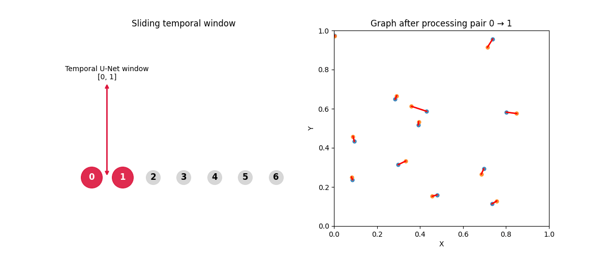

<!--
GENERATED BY ATLAS
SOURCE: D:\Projects\Active\atlas-intelligence\modules\graph-construction\knowledge.md
-->

# Graph Construction

The neural-network stages produce two kinds of information:

* the [Temporal U-Net](../temporal-unet/knowledge.md) produces cell detections and image features;
* the [Simple Node Transformer](../simple-node-transformer/knowledge.md) predicts compatibility between cells in consecutive frames.

Neither component directly produces the final tracking graph.

**Graph construction is the stage that converts those predictions into a structured temporal graph.**

The overall transformation is:

```text
Detected cells
(t,z,y,x)
      │
      ▼
Graph nodes
      │
      │
Transformer edge logits
      │
      ▼
Edge probabilities
      │
      ▼
Thresholding
      │
      ▼
Parent / child constraints
      │
      ▼
Accepted temporal edges
      │
      ▼
Tracking graph
      │
      ├──────────────► optional ILP optimization
      │
      ▼
     .geff
```

The key distinction is:

> **The transformer predicts which connections are plausible; graph construction determines which connections become part of the tracking graph.**

---

# 1. What is the tracking graph?

The final tracking result is represented as a graph.

A graph consists of:

```text
nodes
+
edges
```

In this pipeline, nodes represent detected cells and edges represent temporal relationships between cells.

Conceptually:

```text
                 time →
       
       Frame 0       Frame 1       Frame 2

          A ───────── B ───────── D
           \
            └──────── C ───────── E
```

Here:

```text
A, B, C, D, E
```

are detected cell nodes.

The edges describe temporal relationships:

```text
A → B
A → C
B → D
C → E
```

This structure can represent both ordinary cell continuation and cell division.

---

# 2. What is stored in a node?

Each graph node contains the spatial and temporal location of a detected cell.

Conceptually:

```text
node
├── t
├── z
├── y
└── x
```

Therefore a node can be represented as:

```text
(t, z, y, x)
```

For example:

```text
t   z    y    x
0   12   84   103
1   13   86   105
```

The coordinates identify where the cell was detected and at which time point.

The neural representation used by the transformer is richer than this coordinate, as described in [Node Features](../simple-node-transformer/knowledge.md#13-constructing-the-64-d-node-representation), but the graph itself stores the cell location as graph-node data.

---

# 3. What is stored in an edge?

An accepted temporal edge conceptually contains:

```text
edge
├── source
├── target
├── edge_prob
└── edge_dist
```

For example:

```text
source   target   edge_prob   edge_dist
   12       27       0.91       6.42
```

The edge therefore answers two different questions.

### Edge probability

```text
How strongly does the model believe
that these two cells are temporally connected?
```

### Edge distance

```text
How far apart are the source and target
cells in coordinate space?
```

These are different properties.

The probability is produced by the neural prediction pipeline.

The distance is derived from the coordinates.

---

# 4. From transformer logits to candidate edges

The [Simple Node Transformer](../simple-node-transformer/knowledge.md#15-pairwise-temporal-prediction) produces a matrix:

```text
(n_src, n_tgt)
```

For example:

```text
               target
             D      E      F
          ┌──────┬──────┬──────┐
A         │ 2.1  │ -1.2 │ 0.4  │
          ├──────┼──────┼──────┤
B         │ -0.8 │ 3.7  │ 0.1  │
          ├──────┼──────┼──────┤
C         │ 0.2  │ -0.4 │ 4.2  │
          └──────┴──────┴──────┘
```

.mp4)

These values are **edge logits**.

They are not graph edges yet.

The transformation is:

```text
raw transformer logits
        │
        ▼
edge activation
        │
        ▼
edge probabilities
        │
        ▼
candidate edges
```

The supplied configuration uses:

```python
edge_activation = "softmax"
```

so the logits are converted into normalized probabilities.


---

# 5. Edge probability

For a source cell, the transformer produces a score for every candidate target in the next frame.

For example:

```text
A → D    2.1
A → E   -1.2
A → F    0.4
```

After softmax:

```text
A → D    high probability
A → E    low probability
A → F    intermediate probability
```

The exact values depend on the logits.

The important point is that the candidates compete with one another.

Conceptually:

```text
                 A
                 │
       ┌─────────┼─────────┐
       ▼         ▼         ▼
       D         E         F
       │         │         │
       ▼         ▼         ▼
      pAD       pAE       pAF
```

The result is a set of candidate temporal relationships.

---

# 6. Edge thresholding

After probabilities are calculated, the pipeline applies an edge threshold.

The default configuration uses:

```python
threshold = 0.5
```

The decision can be represented as:

```text
                  edge probability
                         │
              ┌──────────┴──────────┐
              │                     │
            < 0.5                 ≥ 0.5
              │                     │
              ▼                     ▼
           discard               retain
```

Therefore, if:

```text
A → D = 0.82
A → E = 0.31
A → F = 0.67
```

then:

```text
A → D   retained
A → E   discarded
A → F   retained
```

These surviving edges are candidate graph connections.


However, they may still violate graph-level constraints.

---

# 7. Why thresholding is not enough

Suppose the model produces:

```text
A → D = 0.91
A → E = 0.88
A → F = 0.84
```

All three probabilities exceed the threshold.

If every edge were accepted independently, the resulting graph could contain:

```text
        D
       /
      A ─── E
       \
        F
```

with three children.

That may not match the biological assumptions encoded by the tracking system.

Therefore, graph construction applies additional constraints.

This is why:

```text
probability threshold
```

and:

```text
graph constraints
```

are separate operations.

---

# 8. Parent and child constraints

The default configuration uses:

```python
max_parents_per_node = 1
max_children_per_node = 2
```

These limits encode a simple lineage structure.

A node can have:

```text
at most one parent
```

and:

```text
up to two children
```

This allows ordinary continuation:

```text
        A
        │
        ▼
        B
```

and cell division:

```text
        A
       / \
      ▼   ▼
      B   C
```

But it prevents arbitrary many-to-many connections.

---

# 9. Maximum number of parents

The parent constraint:

```python
max_parents_per_node = 1
```

means that a target cell should not receive multiple independent parent links.

For example:

```text
      A
       \
        \
         ▼
         C
        ▲
       /
      B
```

contains:

```text
A → C
B → C
```

which gives `C` two parents.

Under the configured constraint, only one parent relationship can survive.

The graph construction logic therefore considers candidate edges in probability order and rejects edges that would violate the configured parent limit.

---

# 10. Maximum number of children

The child constraint:

```python
max_children_per_node = 2
```

allows a cell to continue into one cell or divide into two.

Valid examples include:

### Normal continuation

```text
A
│
▼
B
```

### Division

```text
    A
   / \
  ▼   ▼
  B   C
```

But a structure such as:

```text
      A
    / │ \
   ▼  ▼  ▼
   B  C  D
```

would exceed the configured maximum of two children.

This constraint therefore gives the graph a biologically meaningful local structure.


---

# 11. Greedy edge selection

When ILP is disabled, candidate edges are processed greedily.

The basic idea is:

```text
1. Compute candidate edge probabilities.
2. Sort candidates from highest to lowest probability.
3. Consider each candidate.
4. Accept it if graph constraints allow it.
5. Otherwise reject it.
```

Conceptually:

```text
Candidate edges

A → D   0.94
B → E   0.91
A → E   0.88
A → F   0.83
C → E   0.79
```

The algorithm starts with:

```text
A → D
```

because it has the highest probability.

Then:

```text
B → E
```

and so on.

An edge can be rejected even when its probability is high if accepting it would violate an already-established graph constraint.

---

# 12. Why greedy selection is local

The greedy algorithm makes decisions based on the current state of the graph.

For example:

```text
edge A → D looks good
        │
        ▼
accept

edge B → D also looks good
        │
        ▼
reject because D already has a parent
```

The decision is local.

The algorithm does not necessarily reconsider earlier decisions because a later combination of edges might produce a better overall tracking solution.

This is the main reason the pipeline provides an optional ILP stage.

---

# 13. Greedy graph construction

The overall greedy process can be visualized as:

```text
Transformer
    │
    ▼
candidate edge probabilities
    │
    ▼
sort by probability
    │
    ▼
highest-probability edge
    │
    ▼
check constraints
    │
 ┌──┴───────────────┐
 │                  │
 ▼                  ▼
valid             invalid
 │                  │
 ▼                  ▼
accept             reject
 │
 ▼
next candidate
```

This process continues until all candidate edges have been considered.

The resulting graph is locally consistent with the configured parent and child limits.


---

# 14. Edge distance

For every accepted edge, the pipeline also calculates a spatial distance between source and target.

Suppose:

```text
source:
(t1, z1, y1, x1)

target:
(t2, z2, y2, x2)
```

The edge stores a distance derived from their spatial coordinates.

Conceptually:

```text
source ●
       │\
       │ \
       │  \
       │   \
       │    ● target
       │
       └────────────
          distance
```

The distance is useful because it provides geometric information about the proposed temporal transition.

It does not replace the model's edge probability.

Instead:

```text
edge probability
    = learned temporal compatibility

edge distance
    = geometric separation
```

---

# 15. Physical coordinates and anisotropic voxels

The microscopy data is anisotropic.

The default physical voxel scale is approximately:

```text
Z = 1.625 µm
Y = 0.40625 µm
X = 0.40625 µm
```

Therefore:

```text
1 voxel in Z
```

does not represent the same physical distance as:

```text
1 voxel in X
```

This is important when interpreting distances.

A naïve calculation that treats:

```text
ΔZ = 4
ΔX = 4
```

as equal physical movements would be incorrect.

The physical scaling should be taken into account whenever a distance is intended to represent physical displacement.

This is one of the reasons the pipeline keeps coordinate systems and voxel scales explicit.

---

# 16. Coordinate systems

There are several coordinate spaces in the inference pipeline.

Keeping them separate is essential.

## Original image coordinates

The source Zarr image is conceptually:

```text
(T, Z, Y, X)
```

These coordinates refer to the original image grid.

---

## Downsampled model coordinates

The model configuration uses:

```python
downsample = (1, 4, 4)
```

Therefore:

```text
Z → ×1
Y → ×1/4
X → ×1/4
```

relative to the original sampling grid.

The model therefore operates on a reduced XY representation.

Detected coordinates initially correspond to this model-space representation.

---

## Original-resolution output coordinates

Before the final graph is saved, the spatial coordinates are scaled back:

```python
coords[:, 1:] *= ds_arr
```

Conceptually:

```text
model coordinates
      │
      │ multiply by downsample factors
      ▼
original-resolution coordinates
```

The graph output therefore corresponds to the original image coordinate system.

---

# 17. Why coordinate conversion matters

Suppose a cell is detected at:

```text
model-space:
(z, y, x) = (10, 20, 30)
```

with:

```text
downsample = (1, 4, 4)
```

then its original-resolution spatial coordinate becomes:

```text
z = 10 × 1 = 10
y = 20 × 4 = 80
x = 30 × 4 = 120
```

So:

```text
model space
    │
    ▼
(10,20,30)

        × (1,4,4)

    ▼

original space
(10,80,120)
```

Without this conversion, the saved graph would not align correctly with the original microscopy volume.

---

# 18. Isotropic resampling

The repository also contains utilities for explicitly resampling anisotropic images into isotropic voxel space.

For example:

```python
resample_image_to_isotropic(...)
```

can transform an image whose physical scale is:

```text
Z = 1.625 µm
Y = 0.40625 µm
X = 0.40625 µm
```

into a representation where the voxel spacing is approximately equal across axes.

Associated coordinate utilities include:

```python
rescale_coords_to_isotropic(...)
rescale_coords_from_isotropic(...)
```

These utilities are useful when an experiment or model specifically requires isotropic geometry.

However, this should not be confused with the standard prediction path.

The default Temporal U-Net inference does not need to resample the entire microscopy volume into isotropic space.

Instead, it operates on the native anisotropic representation and accounts for physical scale where appropriate.

---

# 19. Building the graph

Once nodes and accepted temporal edges have been generated, they are assembled into the tracking graph.

Conceptually:

```text
Nodes
─────
A = (t0,z0,y0,x0)
B = (t1,z1,y1,x1)
C = (t1,z2,y2,x2)
D = (t2,z3,y3,x3)


Edges
─────
A → B
A → C
B → D
```

The graph now represents a set of cell trajectories.

For example:

```text
                    time →

Frame 0       Frame 1       Frame 2

   A ────────── B ────────── D
    \
     └───────── C ────────── E
```

This graph represents:

```text
A → B → D
```

and:

```text
A → C → E
```

which can be interpreted as a division event at `A`.


---

# 20. Graph construction versus neural prediction

This distinction is one of the most important concepts in the pipeline.

The transformer does:

```text
node representations
       │
       ▼
pairwise compatibility
```

Graph construction does:

```text
pairwise compatibility
       │
       ▼
probabilities
       │
       ▼
thresholding
       │
       ▼
structural constraints
       │
       ▼
graph
```

Therefore:

```text
Transformer
    =
    learned edge prediction


Graph construction
    =
    deterministic graph assembly
```

The optional ILP stage adds another level:

```text
ILP
    =
    global graph optimization
```

---

# 21. Optional ILP optimization

Greedy graph construction is fast, but it is local.

The pipeline therefore supports optional Integer Linear Programming optimization.

The ILP stage is enabled with:

```bash
--use-ilp
```

When enabled, the graph is passed to an ILP solver such as:

```python
td.solvers.ILPSolver(...)
```

The solver evaluates the graph globally.

Conceptually:

```text
candidate graph
      │
      ▼
    ILP
      │
      ├── edge selection
      ├── appearance
      ├── disappearance
      ├── division
      └── consistency constraints
      │
      ▼
globally optimized graph
```

This is fundamentally different from the neural-network stages.

---

# 22. Why use ILP?

Consider a situation where several edges are individually plausible:

```text
A → D   0.91
A → E   0.89
B → D   0.87
B → E   0.86
```

A greedy algorithm might make an early decision that prevents a better overall configuration.

An optimization method can instead consider combinations of edges together.

The conceptual difference is:

### Greedy

```text
best edge now
      │
      ▼
accept/reject
      │
      ▼
next edge
```

### ILP

```text
many candidate edges
        │
        ▼
consider combinations globally
        │
        ▼
optimize objective
        │
        ▼
globally consistent solution
```

The ILP stage therefore operates at the **graph level**, not the image level.

---

# 23. ILP objective components

The optional optimization can incorporate costs associated with:

```text
edge selection
track appearance
track disappearance
division
```

The exact optimization formulation belongs to the solver implementation, but conceptually it is trying to find a combination of graph events that gives the best overall tracking solution.

This is different from simply choosing every edge with:

```text
probability > 0.5
```

The optimization considers the interactions between decisions.

---

# 24. Greedy versus ILP

The two modes can be summarized as:

| Aspect                        | Greedy             | ILP                            |
| ----------------------------- | ------------------ | ------------------------------ |
| Decision style                | Local              | Global                         |
| Edge ordering                 | Probability-sorted | Joint optimization             |
| Speed                         | Faster             | More computationally expensive |
| Graph consistency             | Local constraints  | Global objective + constraints |
| Reconsider previous decisions | Generally no       | Yes, through optimization      |
| Neural network involved       | No                 | No                             |
| Operates on                   | Candidate graph    | Candidate graph                |

The ILP stage is therefore best understood as **graph-level post-processing**, not as another neural-network layer.


---

# 25. Creating the `.geff` output

After graph construction—and optional optimization—the resulting graph is serialized to:

```text
*.geff
```

using the repository's graph-saving functionality:

```python
save_graph(...)
```

The output contains the final tracking graph.

Conceptually:

```text
tracking graph
      │
      ▼
save_graph(...)
      │
      ▼
dataset.geff
```

The `.geff` file is therefore the final graph representation produced by the prediction pipeline.

---

# 26. What the `.geff` graph represents

The final graph contains information about:

```text
Nodes:
    time
    z
    y
    x

Edges:
    source
    target
    edge probability
    spatial distance
```

A simplified example is:

```text
Nodes
─────
0: (0, 12, 84, 103)
1: (1, 13, 86, 105)
2: (1, 14, 83, 101)
3: (2, 14, 87, 106)


Edges
─────
0 → 1   probability=0.94
0 → 2   probability=0.89
1 → 3   probability=0.91
```

The graph now represents temporal cell relationships rather than independent frame detections.

---

# 27. The complete graph-construction pipeline

The complete process can be visualized as:

```text
                 Detected cells
                       │
                       ▼
                 Graph nodes
                (t,z,y,x)
                       │
                       │
          ┌────────────┴────────────┐
          │                         │
          ▼                         ▼
    source nodes              target nodes
          │                         │
          └────────────┬────────────┘
                       ▼
                Node Transformer
                       │
                       ▼
                edge logits
                       │
                       ▼
                  softmax
                       │
                       ▼
               edge probabilities
                       │
                       ▼
              threshold > 0.5
                       │
                       ▼
              candidate edges
                       │
                       ▼
            parent/child constraints
                       │
                       ▼
              accepted edges
                       │
                       ▼
               tracking graph
                       │
               ┌───────┴────────┐
               │                │
          ILP disabled       ILP enabled
               │                │
               │                ▼
               │          global optimization
               │                │
               └───────┬────────┘
                       ▼
                    .geff
```

---

# 28. Where graph construction fits in the complete pipeline

The full pipeline can be thought of as:

```text
IMAGE
  │
  │ preprocessing
  ▼
normalized / downsampled image
  │
  │ [Temporal U-Net]
  ▼
dense features + detection logits
  │
  │ detection
  ▼
cell nodes
  │
  │ [Simple Node Transformer]
  ▼
pairwise temporal edge scores
  │
  │ graph construction
  ▼
candidate graph
  │
  │ constraints / optional ILP
  ▼
tracking graph
  │
  ▼
.geff
```


The first stage is described in [Image Preprocessing](../image-preprocessing/knowledge.md#image-preprocessing).

The neural image representation and detection stage are described in [Temporal U-Net](../temporal-unet/knowledge.md#30-complete-u-net-flow).

The node and edge prediction stage is described in [Simple Node Transformer](../simple-node-transformer/knowledge.md#simple-node-transformer).

The final end-to-end behavior is summarized in [Complete Pipeline Analysis](../complete-pipeline-analysis/knowledge.md#1-end-to-end-pipeline).

---

# 29. Failure modes at the graph stage

The separation between detection and graph construction makes debugging easier.

### Too many incorrect edges

Possible causes include:

```text
edge threshold too low
transformer produces poor probabilities
graph constraints too permissive
```

### Correct cells but incorrect parents

Possible causes include:

```text
poor edge probabilities
incorrect spatial relationships
incorrect graph constraints
```

### Multiple possible children

This may be expected when a cell divides, but if the graph contains more than the configured maximum:

```text
max_children_per_node = 2
```

then the graph construction stage should reject excess edges.

### Missing tracks despite good detections

If nodes are detected correctly but connections are missing, the problem is likely downstream of detection:

```text
node representation
        ↓
transformer
        ↓
edge probability
        ↓
threshold
        ↓
graph constraints
```

This is why node recall and edge metrics should be considered separately during evaluation.

---

# 30. Graph-level evaluation

Once the `.geff` graph has been produced, it can be evaluated using the repository's tracking metrics.

The available metrics include quantities such as:

```text
score
edge_jaccard
adj_edge_jaccard
division_jaccard
node_recall
```

These measure different aspects of tracking quality.

For example:

```text
high node recall
+
low edge Jaccard
```

suggests:

```text
cells are being detected
but temporal associations are poor
```

Conversely:

```text
low node recall
```

points much earlier in the pipeline.

A cell that is never detected cannot be recovered by the transformer or graph-construction stage.

---

# 31. Detection errors versus graph errors

This distinction is extremely useful when diagnosing a model.

Consider:

```text
Image
  │
  ▼
Detection
  │
  ▼
Nodes
  │
  ▼
Edge prediction
  │
  ▼
Graph
```

If nodes are missing:

```text
problem likely before graph construction
```

If nodes are correct but edges are wrong:

```text
problem likely in temporal association
or graph construction
```

This gives a practical debugging strategy:

```text
Low node recall
    │
    ▼
inspect preprocessing / U-Net / detection


Good node recall
+
poor edge metrics
    │
    ▼
inspect transformer / edge filtering /
graph constraints
```

---

# 32. Repository components involved

The main repository components involved in graph construction include:

```text
src/
└── biohub_tracking/
    ├── io.py
    ├── img_proc.py
    └── models/
        └── simple_node_transformer.py

scripts/
└── predict_unet_transformer.py
```

Their conceptual responsibilities are:

| Component                     | Responsibility                                              |
| ----------------------------- | ----------------------------------------------------------- |
| `simple_node_transformer.py`  | Produces node representations and temporal edge predictions |
| `img_proc.py`                 | Coordinate and image-processing utilities                   |
| `io.py`                       | Dataset metadata, coordinate handling, graph I/O            |
| `predict_unet_transformer.py` | Connects inference stages and builds the output             |
| graph solver                  | Optional global optimization                                |

---

# 33. Key mental model

The easiest way to understand graph construction is:

```text
The transformer proposes relationships.
The graph builder enforces structure.
The ILP solver can optimize the structure globally.
```

More explicitly:

```text
Node A ─────── Node B
    │              │
    └──────┬───────┘
           ▼
      Transformer
           │
           ▼
      compatibility
           │
           ▼
       probability
           │
           ▼
       threshold
           │
           ▼
     graph constraints
           │
           ▼
       accepted edge
```

Then:

```text
accepted edges
      │
      ▼
tracking graph
      │
      ▼
optional ILP
      │
      ▼
    .geff
```

---

# 34. Important distinctions

Several concepts should not be confused.

### Edge probability ≠ edge distance

```text
edge_prob
    = model confidence / compatibility

edge_dist
    = geometric separation
```

### Transformer ≠ graph builder

```text
transformer
    = predicts candidate relationships

graph builder
    = selects relationships under constraints
```

### Greedy ≠ ILP

```text
greedy
    = local decision-making

ILP
    = global optimization
```

### Model coordinates ≠ output coordinates

```text
model coordinates
    = after downsampling

output coordinates
    = mapped back to original resolution
```

### Detection ≠ tracking

```text
detection
    = find cell nodes

tracking
    = connect nodes through time
```

---

# 35. Final conceptual diagram

The complete graph-building transformation is:

```text
                 CELL DETECTIONS
                       │
                       │
                       ▼
              ┌─────────────────┐
              │  Graph Nodes    │
              │                 │
              │ (t,z,y,x)       │
              └────────┬────────┘
                       │
                       ▼
             64-D node representations
                       │
                       │
                       ▼
              ┌─────────────────┐
              │ Node Transformer│
              └────────┬────────┘
                       │
                       ▼
                edge logits
                       │
                       ▼
                  softmax
                       │
                       ▼
              edge probabilities
                       │
                       ▼
              threshold filtering
                       │
                       ▼
             parent/child limits
                       │
                       ▼
               accepted edges
                       │
                       ▼
             ┌──────────────────┐
             │ Tracking Graph   │
             └────────┬─────────┘
                      │
             ┌────────┴────────┐
             │                 │
          no ILP             ILP
             │                 │
             │          global optimization
             │                 │
             └────────┬────────┘
                      ▼
                   .geff
```

The central idea is:

> **A tracking graph is not produced directly by the neural network. The neural network supplies node detections and edge compatibility scores; graph construction turns those predictions into a structurally valid temporal graph.**


## External Links

- [YouTube](https://youtu.be/bmkLh7Sit1E?si=mwZTHHm67y7ukwVo)
- [Instagram](https://www.instagram.com/reel/DcBAfhzTXzC/?igsh=OW1rMmFlcnJsNGhl&igsi=OW1rMmFlcnJsNGhl)
