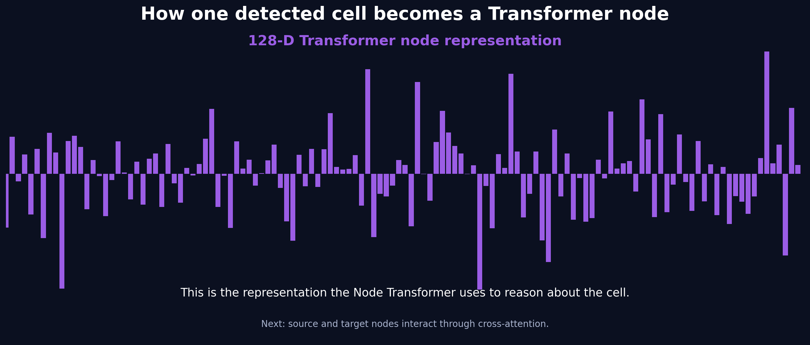

<!--
GENERATED BY ATLAS
SOURCE: D:\Projects\Active\atlas-intelligence\modules\simple-node-transformer\knowledge.md
-->

# Simple Node Transformer

The **Simple Node Transformer** is the second learned component of the tracking pipeline.

The [Temporal U-Net](../temporal-unet/knowledge.md) operates on the image and answers:

> **Where are the cells, and what does the local image context look like?**

The node transformer operates on the detected cells and answers:

> **Which cell in the next frame is this cell connected to?**

The complete transition is:

```text
Microscopy image
      │
      ▼
Temporal U-Net
      │
      ├──────────────► detection logits
      │                       │
      │                       ▼
      │                 cell coordinates
      │                    (t,z,y,x)
      │
      └──────────────► U-Net feature maps
                              │
                              ▼
                       sample at cells
                              │
                              ▼
                         32-D feature
                              │
                              ├──────────────┐
                              │              │
                              ▼              ▼
                       appearance       position
                        feature         encoding
                           32-D            32-D
                              │              │
                              └──────┬───────┘
                                     ▼
                              64-D node feature
                                     │
                                     ▼
                           Simple Node Transformer
                                     │
                                     ▼
                           pairwise edge logits
                                     │
                                     ▼
                              edge probabilities
                                     │
                                     ▼
                             graph construction
```

The final graph construction is described in [Graph Construction](../graph-construction/knowledge.md#1-what-is-the-tracking-graph).

---

## 1. From detected cells to graph nodes

The detection stage converts the dense detection field produced by the U-Net into discrete cell centers.

For every detected cell, we store:

```text
(t, z, y, x)
```

For example:

```text
t   z   y    x
0   4   31   82
0   5   74   51
0   7   19   93
```


These detections become the nodes that the transformer operates on.

It is useful to distinguish three representations:

```text
IMAGE
  │
  ▼
Dense U-Net representation
  │
  ▼
Detected cell
  │
  ├── coordinate: (t,z,y,x)
  │
  ├── U-Net feature: 32-D
  │
  └── positional encoding: 32-D
             │
             ▼
       node representation: 64-D
```

The node is therefore not simply a coordinate.

It combines:

1. **learned image information**, and
2. **deterministic positional information**.

This distinction is important when debugging the pipeline. Poor cell localization belongs primarily to the [Temporal U-Net](../temporal-unet/knowledge.md#20-from-detection-coordinates-to-node-features), whereas poor temporal association belongs downstream in the node and edge prediction stages.

---

# 2. Sampling the U-Net feature at detected cells

The U-Net produces a dense feature volume.

For each spatial location, the feature volume contains a learned feature vector. In the supplied configuration, that feature representation has:

```text
32 dimensions
```

The detector, however, gives us discrete cell coordinates.

Therefore, after detecting a cell at:

```text
(t, z, y, x)
```

.mp4)

the pipeline samples the corresponding location from the U-Net feature map.

Conceptually:

```text
U-Net feature volume

      Z
      │
      │     ● detected cell
      │    /
      │   /
      │  /
      └────────── Y/X

              │
              ▼

        32-D feature vector
```

This produces a learned representation of the image context around the detected cell.

It can be thought of as answering:

> **What does this detected cell look like according to the U-Net?**

The feature is learned from the image during training. It is therefore different from the positional encoding, which is calculated directly from the coordinates.

---

# 3. Two complementary sources of node information

Every node receives two different representations.

### U-Net feature

```text
32-D learned feature
```

This captures information extracted from the image.

Conceptually:

```text
"What does this cell look like?"
```

### Positional feature

```text
32-D deterministic feature
```

This is derived from:

```text
(t, z, y, x)
```

and describes where the cell is located.

Conceptually:

```text
"Where is this cell?"
```

These are concatenated:

```text
32-D U-Net feature
        +
32-D positional feature
        │
        ▼
64-D node feature
```


The resulting 64 dimensions should **not** be interpreted as 64 physical measurements.

Instead:

```text
64-D node representation
=
32-D learned appearance/context representation
+
32-D mathematical representation of position
```

---

# 4. Positional encoding

The positional encoding converts:

```text
(t, z, y, x)
```

into a:

```text
32-D vector
```

The transformation is:

```text
(t,z,y,x)
      │
      ▼
normalize coordinates
      │
      ▼
apply sinusoidal encoding
      │
      ├── t → 8 values
      ├── z → 8 values
      ├── y → 8 values
      └── x → 8 values
              │
              ▼
           32 values
```

This is a representation of position, not an additional source of physical information.

---

## 5. Coordinate normalization

Before applying the sinusoidal functions, each coordinate is normalized using the corresponding image dimension.

Suppose the model input has:

```text
(T, Z, Y, X) = (2, 64, 64, 64)
```

and a detected cell has:

```text
(t,z,y,x) = (1,22,14,17)
```

The normalized coordinates are approximately:

```text
t = 1 / 2  = 0.5
z = 22 / 64 = 0.34375
y = 14 / 64 = 0.21875
x = 17 / 64 = 0.265625
```

The important point is that the transformer receives a representation relative to the model's coordinate space rather than the raw integer voxel indices.

This is **coordinate normalization**.

It should not be confused with:

* image intensity normalization,
* physical voxel-size conversion,
* cell-size estimation,
* cell morphology extraction.

Those are separate concepts described in [Image Preprocessing](../image-preprocessing/knowledge.md#4-intensity-normalization) and [Coordinate Systems](../graph-construction/knowledge.md#16-coordinate-systems).

---

# 6. Why does one coordinate become eight values?

Each of the four coordinates is encoded independently.

For one coordinate, the implementation uses four frequencies:

```text
[1, 2, 4, 8]
```

For every frequency, both sine and cosine are calculated.

Therefore:

```text
4 frequencies
×
2 functions
=
8 values
```

For example:

```text
x
│
├── frequency 1 → sin, cos
├── frequency 2 → sin, cos
├── frequency 4 → sin, cos
└── frequency 8 → sin, cos
            │
            ▼
           8-D
```

The same operation is applied to:

```text
t
z
y
x
```

giving:

```text
t → 8 values
z → 8 values
y → 8 values
x → 8 values
```

Therefore:

```text
4 coordinates × 8 values
=
32-D positional encoding
```

---

# 7. The sinusoidal transformation

For a normalized coordinate, the encoding uses:

```text
angle = normalized_coordinate × frequency × π
```

For every frequency:

```text
sin(angle)
cos(angle)
```

are evaluated.

For example, suppose:

```text
x = 32
X = 64
```

Then:

```text
x_norm = 32 / 64
       = 0.5
```

The four angles become:

```text
0.5 × 1 × π = π/2
0.5 × 2 × π = π
0.5 × 4 × π = 2π
0.5 × 8 × π = 4π
```

The resulting representation is:

```text
[
    sin(π/2), cos(π/2),
    sin(π),   cos(π),
    sin(2π),  cos(2π),
    sin(4π),  cos(4π)
]
```

The exact numerical values are less important than the structure:

```text
one coordinate
      │
      ▼
normalized coordinate
      │
      ▼
four frequencies
      │
      ▼
sin + cos
      │
      ▼
eight values
```

---

# 8. Why use multiple frequencies?

A single sinusoidal function provides one positional signal.

Multiple frequencies provide different scales of positional variation.

Conceptually:

```text
frequency 1
────────────────────────────
slow positional variation


frequency 2
────────────────────────────
faster positional variation


frequency 4
────────────────────────────
higher-frequency variation


frequency 8
────────────────────────────
finest positional variation
```

The transformer therefore receives several mathematical views of the same coordinate.

The frequencies are not additional coordinates.

Instead:

```text
one physical coordinate
        │
        ▼
multiple frequency representations
        │
        ▼
richer positional feature
```

This gives later neural-network layers a richer basis for learning spatial and temporal relationships.

---

# 9. Why use both sine and cosine?

For every frequency, both:

```text
sin(angle)
```

and:

```text
cos(angle)
```

are included.

They provide complementary information about the phase of the periodic signal.

Mathematically:

```text
cos(θ) = sin(θ + π/2)
```

so the two functions provide phase-shifted views of the same coordinate.

The pair:

```text
(sin(θ), cos(θ))
```

can be visualized as a point moving around a unit circle:

```text
             y
             ↑
         ●
       /   \
      /     \
─────●───────●────→ x
      \     /
       \   /
         ●
```

The important intuition is:

```text
coordinate
    │
    ├── sine signal
    └── cosine signal
             │
             ▼
      complementary phase information
```

This is why every frequency contributes **two values**, not one.

---

# 10. The complete 32-D positional vector

The four coordinate encodings can be viewed as four blocks:

```text
dimensions 0–7
    t positional encoding

dimensions 8–15
    z positional encoding

dimensions 16–23
    y positional encoding

dimensions 24–31
    x positional encoding
```

Therefore:

```text
        t       z       y       x
        │       │       │       │
        ▼       ▼       ▼       ▼
       8-D     8-D     8-D     8-D
        │       │       │       │
        └───────┴───────┴───────┘
                    │
                    ▼
                  32-D
```

The 32 dimensions are deterministic.

Given the same:

```text
(t,z,y,x)
```

and image dimensions, the positional encoder produces the same vector.

This is fundamentally different from the U-Net feature, which is learned from the image.

.mp4)

---

# 11. Does positional encoding describe cell size?

**No.**

The positional encoding only represents where the detected node is located.

It does not directly encode:

```text
cell radius
cell diameter
cell volume
cell morphology
cell segmentation area
cell shape
```

For example, imagine two cells with identical centers:

```text
Cell A                     Cell B

     ●                         ●
   small                     large
```

If both have the same:

```text
(t,z,y,x)
```

then their positional encodings are identical.

Their U-Net features may still differ because their surrounding image structures differ.

This gives the two representations complementary roles:

```text
U-Net feature
    │
    └── "What does the cell look like?"

Positional encoding
    │
    └── "Where is the cell?"
```

---

# 12. Why not use raw `(t,z,y,x)`?

The transformer could theoretically receive the four raw coordinates directly.

That would give it:

```text
4 scalar features
```

Instead, the pipeline converts them into:

```text
32 positional features
```

The advantage is that the model receives multiple nonlinear periodic representations of every coordinate:

```text
slow variation
+
medium variation
+
faster variation
+
finest variation
```

with:

```text
sine
+
cosine
```

for every frequency.

The 32-D representation should therefore be understood as a **feature basis for position**, rather than as additional physical coordinates.

---

# 13. Constructing the 64-D node representation

Once both representations are available:

```text
U-Net feature
    32-D

positional encoding
    32-D
```

they are concatenated:

```text
┌───────────────────────────────┐
│      U-Net feature            │
│          32-D                 │
├───────────────────────────────┤
│      positional feature       │
│          32-D                 │
└───────────────────────────────┘
              │
              ▼
          64-D node
```

The resulting node can be written conceptually as:

```text
node =
[
    learned image/context features,
    deterministic positional features
]
```

Therefore:

```text
64-D node
=
32-D U-Net feature
+
32-D positional encoding
```


This is the input representation used by the downstream transformer.

---

# 14. Why the node representation matters

The transformer needs to decide whether two cells in consecutive frames are related.

Consider:

```text
Frame t                    Frame t+1

    A                          D
    B                          E
    C                          F
```

A useful association requires more than just knowing that:

```text
A exists
D exists
```

The model benefits from information about:

```text
A's appearance
A's location
D's appearance
D's location
```

The 64-D node representation supplies this information.

Conceptually:

```text
Node A
├── appearance/context
└── position

Node D
├── appearance/context
└── position

       │
       ▼

   Transformer

       │
       ▼

compatibility(A,D)
```

The same operation is performed for every candidate source-target pair.

---

# 15. Pairwise temporal prediction

For two consecutive frames, suppose:

```text
Frame t:
A
B
C

Frame t+1:
D
E
F
```

The transformer produces a matrix of raw edge logits:

```text
               target
             D      E      F
          ┌──────┬──────┬──────┐
A         │ 2.1  │ -1.2 │ 0.4  │
          ├──────┼──────┼──────┤
B         │ -0.8 │ 3.7  │ 0.1  │
          ├──────┼──────┼──────┤
C         │ 0.2  │ -0.4 │ 4.2  │
          └──────┴──────┴──────┘
```

The matrix has shape:

```text
(n_src, n_tgt)
```

where:

```text
row    = source node
column = target node
value  = compatibility logit
```

For example:

```text
2.1
```

at:

```text
A → D
```

means the model assigned that source-target pair a raw compatibility score of `2.1`.

.mp4)

These values are **not yet graph edges**.

They are model outputs that must go through the edge-probability and filtering stages described in [Graph Construction](../graph-construction/knowledge.md#5-edge-probability).

---

# 16. Softmax edge activation

The supplied inference configuration uses:

```python
edge_activation = "softmax"
```

Therefore, the raw edge logits are converted using softmax.

Conceptually:

```text
raw edge logits
      │
      ▼
    softmax
      │
      ▼
normalized candidate probabilities
      │
      ▼
edge filtering
```

Softmax makes candidate targets compete with one another.

For a source cell:

```text
A
```

the model effectively compares:

```text
A → D
A → E
A → F
```

rather than treating every candidate as a completely independent decision.

The interpretation is approximately:

> **Which target is this source most compatible with?**

.mp4)

---

# 17. Softmax versus sigmoid

The pipeline can also use sigmoid activation, but the interpretation differs.

### Softmax

```text
A → D
A → E
A → F
      │
      ▼
    compete
```

The candidate probabilities are normalized relative to one another.

The interpretation is:

```text
"Which target is this source most compatible with?"
```


### Sigmoid

Each pair is evaluated independently:

```text
A → D ──► probability
A → E ──► probability
A → F ──► probability
```

The interpretation becomes:

```text
"How plausible is this pair independently?"
```


The current supplied configuration uses:

```text
softmax
```

so the downstream graph-building stage works with competitive target probabilities.

---

# 18. From probabilities to candidate edges

After activation, the pipeline applies an edge threshold.

The default is:

```python
threshold = 0.5
```

Conceptually:

```text
edge probability
      │
      ├── < 0.5 ──► discard
      │
      └── ≥ 0.5 ──► candidate edge
```

The surviving edges are then sorted from highest probability to lowest.

The graph-building stage applies additional structural constraints.

For example:

```text
max_parents_per_node = 1
max_children_per_node = 2
```

These constraints are discussed in detail in [Graph Construction](../graph-construction/knowledge.md#6-edge-thresholding).

---

# 19. Parent and child constraints

The default graph assumptions reflect a basic cell-lineage model.

A cell can normally have:

```text
at most one parent
```

and:

```text
up to two children
```

Therefore, a normal continuation can be represented as:

```text
A
│
▼
B
```

and a division can be represented as:

```text
    A
   / \
  ▼   ▼
  B   C
```

This means the transformer is not directly generating an arbitrary graph.

It generates **candidate temporal relationships**.

The downstream graph-construction stage determines which candidates are actually retained.

This separation is important:

```text
Transformer
    │
    └── predicts compatibility

Graph construction
    │
    └── decides which compatible edges survive
```

---

# 20. Edge distance

For accepted temporal relationships, the pipeline also calculates a spatial distance:

```python
edge_dist
```

An edge therefore contains conceptually:

```text
source
target
edge_prob
edge_dist
```

The two numerical quantities describe different properties.

### Edge probability

```text
How strongly does the model believe
these nodes should be connected?
```

### Edge distance

```text
How far apart are these nodes
in coordinate space?
```

They should therefore not be interpreted as interchangeable.

The probability is a learned compatibility signal.

The distance is a geometric measurement.

---

# 21. Sliding temporal windows

The transformer does not necessarily receive the entire video at once.

The inference pipeline processes temporal windows.

For:

```text
window_size = 2
```

the sequence is:

```text
[0,1]
   [1,2]
      [2,3]
         [3,4]
```

Each window gives the U-Net temporal context while allowing the pipeline to generate relationships between consecutive frames.


The windowing strategy is part of the broader inference process described in [Complete Pipeline Analysis](../complete-pipeline-analysis/knowledge.md#16-sliding-temporal-windows).

---

# 22. Keeping nodes and frame pairs globally consistent

Because temporal windows overlap, the same frame can appear in multiple windows.

The prediction code therefore maintains registries such as:

```python
seen_frames
seen_pairs
coord_offset
```

These help prevent duplicate processing.

Conceptually:

```text
Window 1
[0,1]
   │
   └── pair (0,1)

Window 2
[1,2]
   │
   └── pair (1,2)

Window 3
[2,3]
   │
   └── pair (2,3)
```


The windows provide local temporal context, while the final node and edge registries remain global to the video.

---

# 23. What the transformer actually learns

It is useful to distinguish the learned and deterministic parts.

### Learned

The neural network learns:

```text
image
  │
  ▼
U-Net feature
  │
  └─────────────┐
                │
position ───────┤
                ▼
          node representation
                │
                ▼
           transformer
                │
                ▼
        temporal compatibility
```


The transformer therefore learns how image-derived features and positional information relate to temporal association.

### Deterministic

The following are not learned by the transformer:

```text
coordinate normalization
sin/cos positional encoding
edge threshold
parent limit
child limit
coordinate conversion
graph construction
```

Those are algorithmic components surrounding the learned model.

---

# 24. The complete node-to-edge transformation

The entire Simple Node Transformer stage can be summarized as:

```text
Detected cell
(t,z,y,x)
      │
      ├─────────────────────┐
      │                     │
      ▼                     ▼
sample U-Net feature    positional encoding
      │                     │
      ▼                     ▼
    32-D                  32-D
      │                     │
      └──────────┬──────────┘
                 ▼
             concatenate
                 │
                 ▼
              64-D node
                 │
                 │
        ┌────────┴────────┐
        │                 │
        ▼                 ▼
   source node        target node
        │                 │
        └────────┬────────┘
                 ▼
             Transformer
                 │
                 ▼
          pairwise logits
                 │
                 ▼
              softmax
                 │
                 ▼
         edge probabilities
                 │
                 ▼
        graph-level filtering
```

The result is a set of candidate temporal relationships that can be converted into the tracking graph.

---

# 25. The most important mental model

The simplest way to remember this stage is:

```text
U-Net feature
    │
    └── "What does the cell look like?"

Position encoding
    │
    └── "Where is the cell?"

       ↓ concatenate

64-D node
       │
       │ transformer
       ▼
"What cell in the next frame
 is this cell most compatible with?"
       │
       ▼
edge score
```

The transformer does **not** directly predict a complete track.

It predicts pairwise temporal compatibility.

The subsequent [Graph Construction](../graph-construction/knowledge.md#19-building-the-graph) stage turns those pairwise predictions into a valid tracking graph.

---

# 26. Key dimensions at a glance

| Representation          |       Dimensions | Meaning                              |
| ----------------------- | ---------------: | ------------------------------------ |
| Cell coordinate         |                4 | `(t,z,y,x)`                          |
| U-Net feature           |               32 | Learned image/context representation |
| One coordinate encoding |                8 | 4 frequencies × sine/cosine          |
| Positional encoding     |               32 | 4 coordinates × 8 values             |
| Node representation     |               64 | U-Net feature + position             |
| Edge logits             | `(n_src, n_tgt)` | Pairwise source-target compatibility |

The most important dimensional transformation is:

```text
(t,z,y,x)
     │
     ▼
32-D positional encoding

U-Net feature
     │
     ▼
32-D learned feature

32 + 32
   │
   ▼
64-D node
   │
   ▼
pairwise transformer
   │
   ▼
(n_src × n_tgt) edge logits
```

---

# 27. Where this stage fits in the complete pipeline

The complete pipeline can be viewed as three increasingly structured representations:

```text
IMAGE
  │
  │ Temporal U-Net
  ▼
DENSE FEATURES + DETECTION FIELD
  │
  │ local maxima
  ▼
CELL NODES
(t,z,y,x)
  │
  │ feature + position
  ▼
64-D NODE REPRESENTATIONS
  │
  │ transformer
  ▼
PAIRWISE TEMPORAL SCORES
  │
  │ filtering / constraints
  ▼
TRACKING GRAPH
  │
  │ optional optimization
  ▼
.geff
```

The first transition is handled by the [Temporal U-Net](../temporal-unet/knowledge.md#26-detection-output).

The second transition—from nodes to candidate temporal relationships—is the responsibility of this **Simple Node Transformer** stage.

The final conversion from candidate relationships into a graph is covered in [Graph Construction](../graph-construction/knowledge.md#19-building-the-graph).

---

## Key takeaways

1. **Detected cells become graph nodes.**
2. Every node receives a **32-D learned U-Net feature**.
3. Every node also receives a **32-D deterministic positional encoding**.
4. Each coordinate `(t,z,y,x)` contributes **8 values**.
5. The 8 values come from **four frequencies × sine/cosine**.
6. The two 32-D representations are concatenated into a **64-D node representation**.
7. The transformer compares source and target nodes across consecutive frames.
8. It produces a **source × target matrix of edge logits**.
9. Softmax converts these logits into competitive candidate probabilities in the supplied configuration.
10. The probabilities are passed to [Graph Construction](../graph-construction/knowledge.md#19-building-the-graph), where thresholds and graph constraints determine the final edges.

> **The U-Net describes the cell; positional encoding describes where it is; the transformer uses both to predict temporal relationships.**


